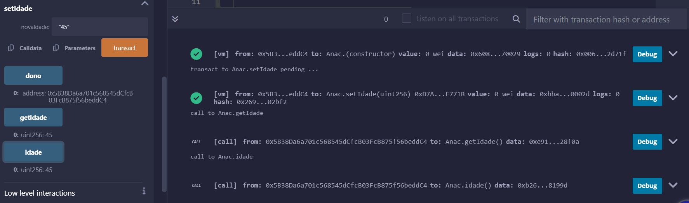

Quando o endereço corresponde ao endereço do dono, o compilador permite a edição do setIdade, que é retornada no getIdade.

No entanto, quando o endereço é diferente, o compilador não permite a alteração da idade em setIdade

mostrado em sala de aula, pois o remix foi sobrecarregado e deixou de fazero deploy

Prompts utilizados no chatgpt:

- como criar uma variável de estado no solidity
- como alterar uma função para apenas ser alterada pelo dono

e ajuda para debugar algumas partes do código com erro de compilação
